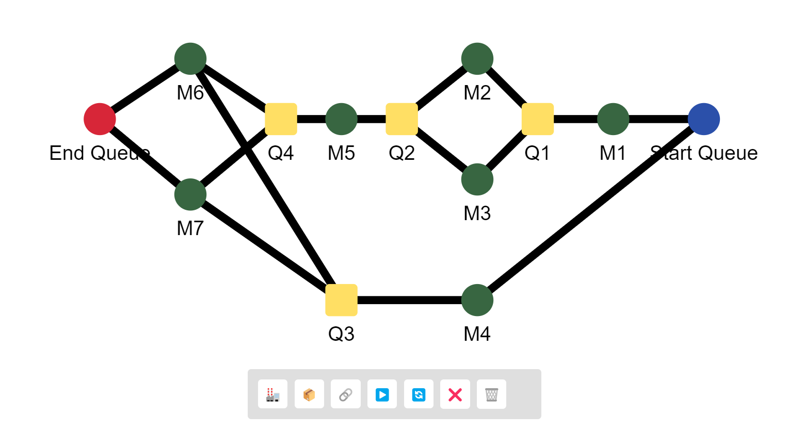
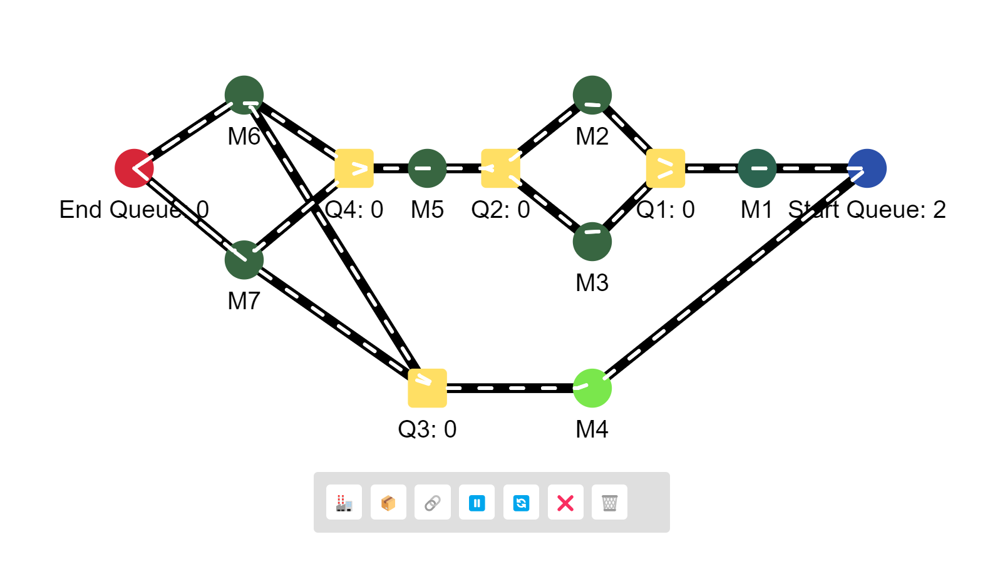
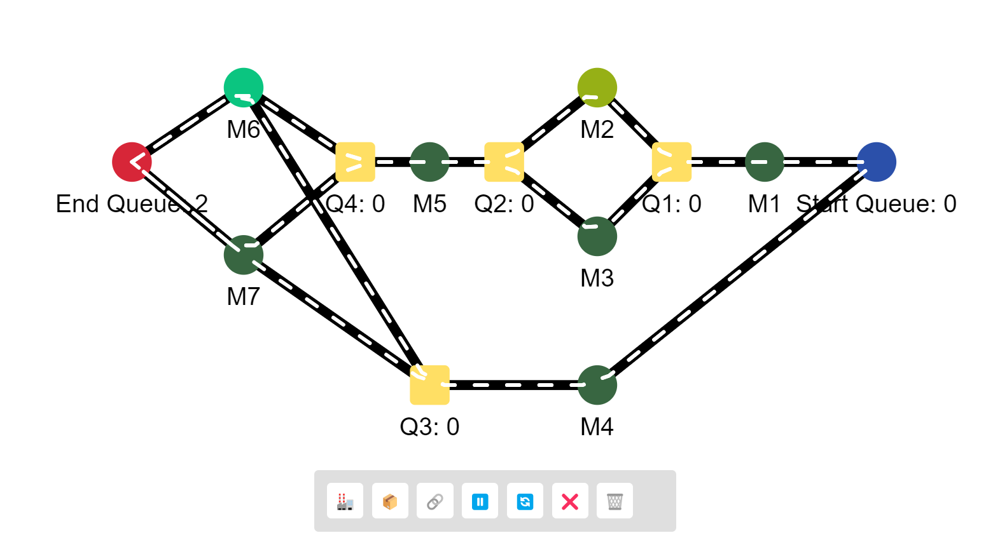
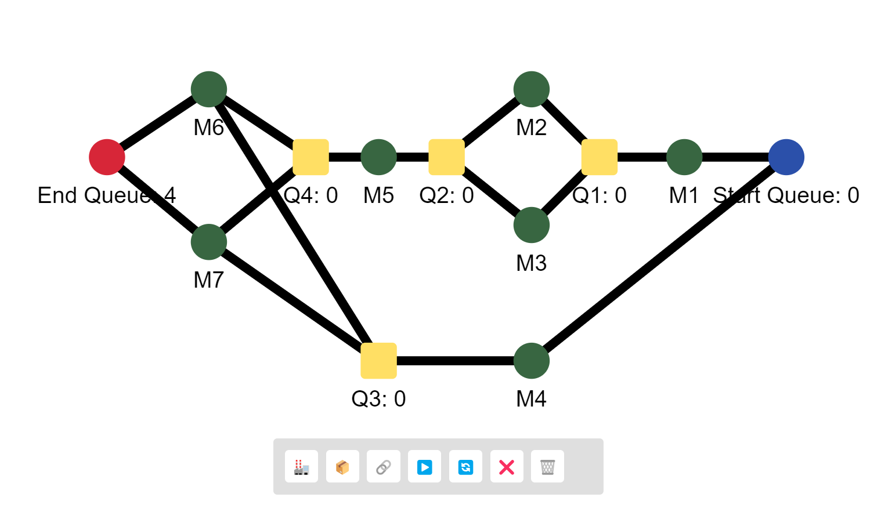
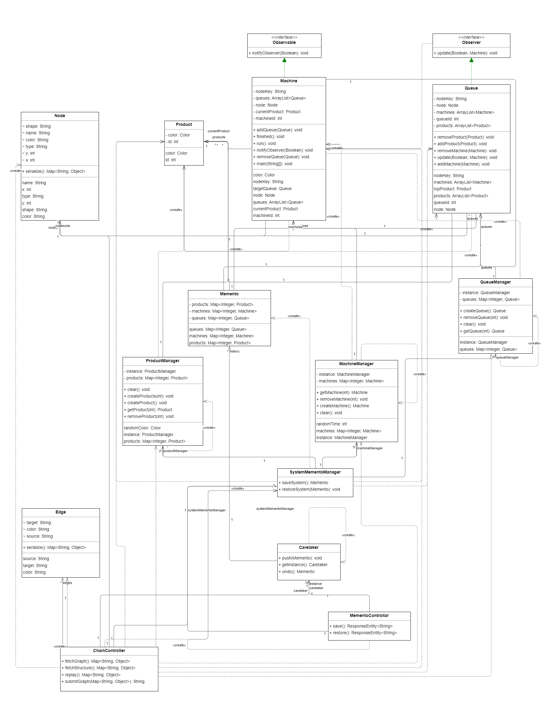

# Producer/Consumer Simulation

This simulation program models an assembly line where various products undergo processing by different machines connected through queues. Developed using Java Spring Boot for the backend and Vue for the frontend, this application provides a graphical representation of the production line. The program leverages design patterns such as concurrency, snapshot, and observer for an efficient and user-friendly simulation experience.









---

## **Features:**

1. **Dynamic UI Setup:**
    - Users can graphically add processing machines (Ms) and queues (Qs) via the UI, connecting them arbitrarily for a flexible simulation setup.
2. **Random Input Rate:**
    - Start Queue has a random input rate, introducing variability into the simulation.
3. **Concurrent Processing:**
    - Each processing machine (M) runs on a separate thread, ensuring concurrent processing and realistic simulation.
4. **Real-time Queue Display:**
    - The UI displays the number of elements in the queues in real-time, providing users with an instant view of the simulation's progress.
5. **Machine Interaction:**
    - Machines flash upon completing the servicing of an item, and each product has a unique color. Machines change their color to match the product being processed, simplifying visualization.
6. **Simulation Control:**
    - Users can end the simulation, start a new simulation, or replay the previous simulation, enhancing the interactive nature of the program.

---

## **Design Patterns Applied:**

1. **Concurrency Design Patterns (Producer-Consumer) (in `Queue` and `Machine`):**
    - The **`Queue`** and **`Machine`** classes implement Producer-Consumer design pattern. They use mechanisms such as threads and synchronization to handle concurrent processing of products. The producer-consumer pattern is applied to manage the flow of products between queues and machines.
2. **Observer Pattern (in `Observer` and `Observable`):**
    - The **`Observer`** and **`Observable`** classes implement the Observer design pattern. The **`Observer`** interface defines a contract for objects interested in changes, and concrete observers (e.g., **`Queue`**) implement this interface. The **`Observable`** class maintains a list of observers and notifies them of state changes.
3. **Snapshot Pattern (in `Memento`, `SystemMementoManager`, and `Caretaker`):**
    - The **`Memento`** class represents the Snapshot design pattern, encapsulating the state of machines, products, and queues. The **`SystemMementoManager`** is responsible for creating and restoring mementos (snapshots), and the **`Caretaker`** keeps a history of mementos for undo and redo operations.
4. **Factory Method Pattern (in `MachineManager`, `ProductManager`, and `QueueManager`):**
    - The **`MachineManager`**, **`ProductManager`**, and **`QueueManager`** classes act as factory methods for creating instances of **`Machine`**, **`Product`**, and **`Queue`** respectively. They encapsulate the creation logic, promoting flexibility and allowing the addition of new instances without modifying existing code.
5. **Singleton Pattern (in `MachineManager`, `ProductManager`, `QueueManager`, and `SystemMementoManager`):**
    - The **`MachineManager`**, **`ProductManager`**, **`QueueManager`**, and **`SystemMementoManager`** classes follow the singleton pattern, ensuring that only one instance of each manager exists throughout the application. This provides a centralized point of control for managing machines, products, queues, and system mementos.

---

## **UML Class Diagram:**

This section provides a high-level overview of the Unified Modeling Language (UML) representation for the Drawing Application. UML diagrams serve as visual aids to understand the structural and behavioral aspects of the application's design.



---

## **User Guide:**


1. **Adding Machines and Queues:**
    - To add a processing machine, click the 🏭 button in the UI.
    - To add a queue, click the 📦 button in the UI.
2. **Adding Edges (Connections):**
    - To establish connections between nodes (machines and queues):
        - Click on the source node (from which the edge originates).
        - Press **Shift + Alt** to enable multi-selection mode.
        - Click on the target node (to which the edge connects).
        - Click the 🔗 button to create the connection.
3. **Deleting Machines, Queues, or Edges:**
    - To delete a machine, queue, or edge:
        - Click on the machine, queue, or edge that you want to delete.
        - Click the ❌ button to remove the selected item.
4. **Starting the Simulation:**
    - Ensure all connections are established correctly.
    - Click the ▶️ button to start the simulation.
5. **Stopping the Simulation:**
    - At any time during the simulation, click the ⏸ button to stop it.
6. **Replaying a Previous Simulation:**
    - Click the 🔄 button.
7. **Clearing the Board:**
    - To clear the entire board and remove all machines, queues, and edges, click the 🗑️ button.


>💡 **Note:**
>
>- Edges are animated in their respective directions, making it easy to understand the flow of products between machines and queues.
>- Machines flash with the color of the product they are currently processing, enhancing the visual feedback of the simulation. Each queue displays the current count of products it holds.


---

## **How to Run:**

1. **Clone the Repository:**
    - Clone the repository to your local machine:
        
        ```bash
        git clone https://github.com/AbdElRahmanOsama182/Concurrency-Simulation/
        ```
        
2. **Backend Setup (Java Spring Boot):**
    - Open the backend project in your IDE.
    - Run the Spring Boot application `**BackendApplication.java**` on port 8080.
3. **Frontend Setup (Vue):**
    - Navigate to the Vue project directory.
    - Install dependencies: **`npm i`**
    - Run the Vue application on port 8081: **`npm run serve -- --port 8081`**
4. **Access the Application:**
    - Open your browser and go to: **`http://localhost:8081`**
    - Explore the simulation through the user interface.


> 💡 **Note:**
> Ensure backend runs on port 8080, and frontend on port 8081. Adjust ports if needed.

---

## **Simulation:**
https://github.com/AbdElRahmanOsama182/Concurrency-Simulation/assets/52374998/5bc4cacf-7ba6-4925-bff3-14ffb0857b00


